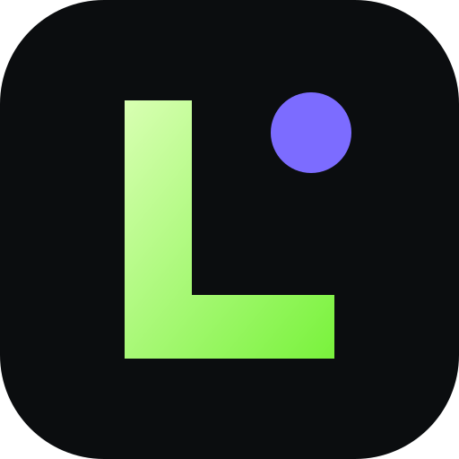

<div align="center">
  
  <h1>LifeOS</h1>
  <p><strong>Your life, in one calm place.</strong></p>
  <p>A beautiful, private, local-first command center for tasks, habits, focus and money.</p>

  <p>
    <a href="https://mmoya113.github.io/lifeos/"><strong>Live demo →</strong></a>
    · <a href="#features">Features</a>
    · <a href="#quick-start">Quick start</a>
    · <a href="CONTRIBUTING.md">Contribute</a>
  </p>

  
  
  
  
</div>

---

Most productivity apps ask you to build your life around their system. LifeOS gives you a small set of useful tools and then gets out of the way.

It runs entirely in your browser. There is no account, backend, tracking script or subscription. Your information stays in local storage and can be exported at any time.

## Features

- **Today dashboard** — one calm view of the day, including a dynamic momentum score.
- **Task planner** — priorities, areas, due dates and useful filters.
- **Habit system** — daily check-ins, streaks and a seven-day heatmap.
- **Focus timer** — Pomodoro sessions, intentions and focus history.
- **Money tracker** — lightweight income, expense and balance tracking.
- **Command palette** — press <kbd>Ctrl</kbd>/<kbd>⌘</kbd> + <kbd>K</kbd> to jump anywhere.
- **Local-first privacy** — zero analytics and zero network requests for your personal data.
- **Backup and restore** — export everything as human-readable JSON.
- **Installable PWA** — works offline and feels at home on desktop or mobile.
- **Dark and light themes** — because a command center should feel like yours.
- **Zero dependencies** — plain HTML, CSS and modern JavaScript. Fast by default.

## Quick start

No build step is required.

```bash
git clone https://github.com/mmoya113/lifeos.git
cd lifeos
python -m http.server 8080
```

Open [localhost:8080](http://localhost:8080). You can also double-click `index.html`; a local server is only needed for offline PWA support.

## Keyboard shortcuts

| Shortcut | Action |
|---|---|
| <kbd>Ctrl</kbd>/<kbd>⌘</kbd> + <kbd>K</kbd> | Command palette |
| <kbd>1</kbd> | Today |
| <kbd>2</kbd> | Planner |
| <kbd>3</kbd> | Habits |
| <kbd>4</kbd> | Focus |
| <kbd>5</kbd> | Money |

## Philosophy

LifeOS is built around four ideas:

1. **Private by default.** Personal data should not become somebody else's business model.
2. **Useful immediately.** No two-hour setup ritual before you can check off a task.
3. **Calm, not addictive.** Progress should be visible without turning life into a casino.
4. **Easy to own.** No framework lock-in, proprietary file format or paid cloud required.

## Data and privacy

All data is stored under a single `localStorage` key in your browser. LifeOS does not include analytics, cookies, external APIs or a backend. The optional Google Fonts stylesheet affects typography only; remove the first line of `styles.css` if you prefer a fully offline system font stack.

Use **Settings → Export backup** regularly if the data matters to you. Browser storage can be cleared by the browser or operating system.

## Development

The app intentionally has no production dependencies. The small core module has tests powered by Node's built-in test runner:

```bash
npm test
```

See [CONTRIBUTING.md](CONTRIBUTING.md) for the project structure and contribution workflow.

## Roadmap

- [ ] Custom dashboards and draggable cards
- [ ] Recurring tasks and flexible habit schedules
- [ ] Encrypted cross-device sync as an optional add-on
- [ ] Calendar import/export
- [ ] More accessible color themes
- [ ] Community-built widgets

Have an idea? [Open a feature request](../../issues/new?template=feature_request.yml).

## Contributing

Bug reports, translations, design improvements and new ideas are welcome. Please read the [contributing guide](CONTRIBUTING.md) and keep the zero-dependency, local-first spirit intact.

## License

[MIT](LICENSE) — use it, modify it and make it yours.

<div align="center">
  <sub>Built for people who want momentum without surveillance.</sub>
</div>
